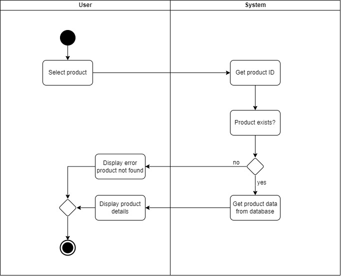
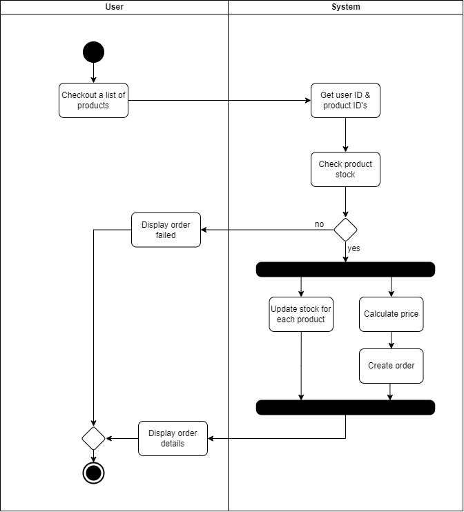
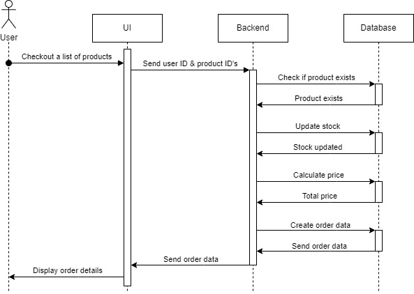

# E-Commerce Design System

> Assignment for RevoU - FSSE week 6

## High Level Design

### Activity Diagram

#### Product Details Flow



#### Create Order Flow



## Create Order Design System

### Sequence Diagram



### Pseudocode

```
function createOrder(userId, products):
    let totalPrice = calculatePrice(products)
    updateProductStock(products)
    let order = createOrderData(dataBase, userId, products, totalPrice)

    return order
```

```
function calculatePrice(products):
    let totalPrice = 0
    for each product in products:
        let price = product.price
        totalPrice += price

    return totalPrice
```

```
function updateProductStock(products):
    for each product in products:
        product.stock -= 1
```

```
function createOrderData(dataBase, userId, products, totalPrice):
    let dataBase = connectDatabase()
    let data = {
        "products": products,
        "totalPrice": totalPrice,
        "userId": userId
    }
    pushToDatabase(data, dataBase.order)

    return data
```

### Complexity Analysis

| Function             | Complexity |
| -------------------- | ---------- |
| `createOrder`        | $O(1)$     |
| `calculatePrice`     | $O(n)$     |
| `updateProductStock` | $O(n)$     |
